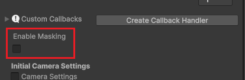
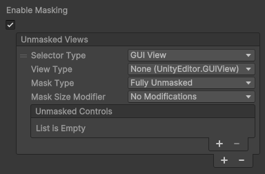
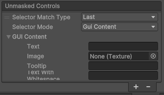
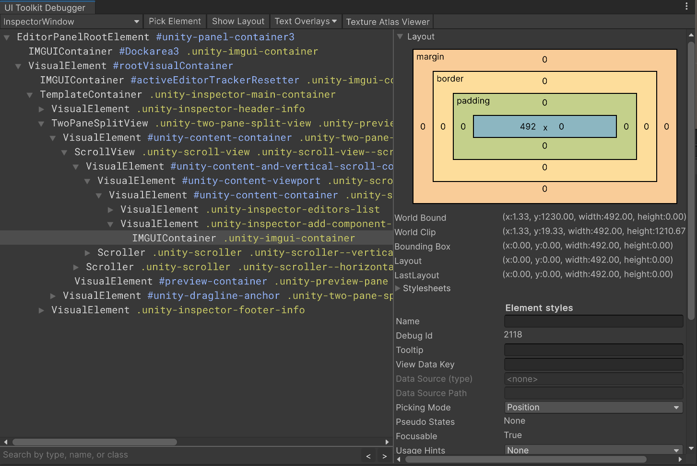
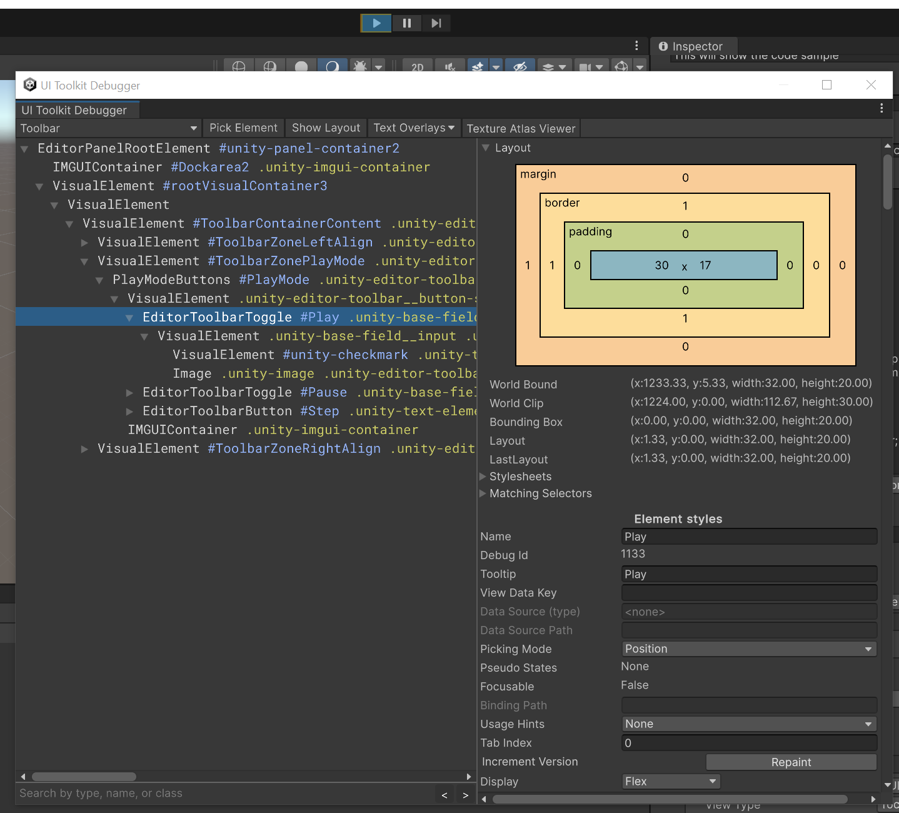
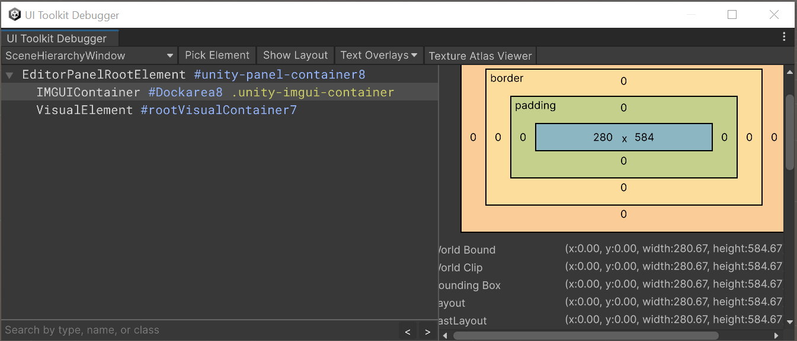
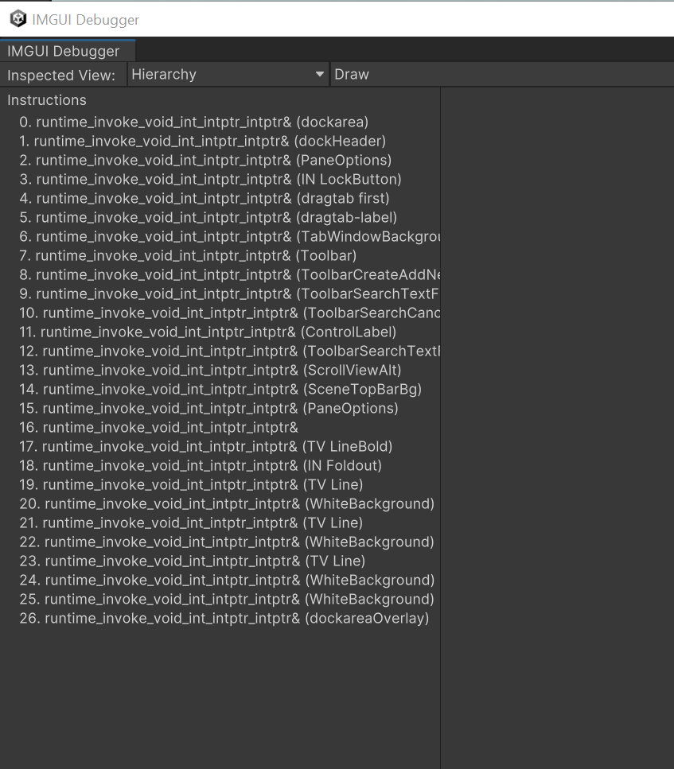

# Highlighting Guide

The IET framework can darken the editor and block interaction and only highlight some part.
This is done on a per Tutorial Page basis, at the bottom of the Tutorial Page inspector. 

If the option **Enable masking** is enabled, when this page get displayed, the editor will be masked and the tutorial window will be highlighted.

Once the option enabled, a new array called **Unmasked Views** will appears. Adding elements to this array will allow to highlight other part of the editor (*unmask* them as the editor is by default completly masked if masking is enabled).

- **Selector Type** : this is to select the part of the editor that need to be selected. It have two value :
    - **GUI View** : this is to designate part of the editor not in a tabbed windows, like the toolbar at the top, the App Status bar at the bottom etc.
        - **View Type** : only visible if GUI View is selected. Choose in that drop down the view you want to highlight (toolbar, app status bar etc.)
    - **Editor Window** : this is to select one of the editor window, which include all the things tabbed in the editor (Like the Scene View, The Inspector, the Project browser etc.). **In most case this is the option you want to pick**
        - **Editor Window Type**: only visible if Editor Window is selected. This is the type of the window you want to highlight (Scene View , Inspector etc.)
        - **Alternate Editor Window Type** : most of the time, you can leave this empty. This is to allow to support multiple version of Unity with a single IET. Sometime between major Unity version, Editor Window type name change, so this list can contains all the alternate name so the window is found across multiple Unity version.
- **Mask Type** : define if the selected view is *Fully Unmasked* (the user can interact with it) or if it *Blocks Interaction* (the user still cannot interact with the highlighted view. useful to show something exist but not let the users change its value)
- **Mask Size Modifier**: define if the mask extend to the whole window or is unmodified. In most case you want to keep this to *No Modification*
- **Unmasked Controls**: by default the whole of the GUI View or Editor Window will be highlighted. But adding specific UI control to that list will highlight *only* those controls instead of the whole view/window.

## Unmasked Controls

An umasked control entry have 2 settings

- **Selector Match Type** : if multiples controls match the selection criteria defined after, this inform which control is selected : the *Last* one found, the *First* one or *All* of them.
- **Selector Mode**: which selection method is used to find the control you want to higlight

### Gui Content Selector

Gui Content is the legacy imgui mode of defining the content of a UI element (the text or image in a label, button etc.). Most of the editor have now been ported to UI Toolkit, so this won't work for those, but some part may still use that. When this is selected more options will appears. If any of those match exactly any GUI Content in the selected view/window, those controls will be selected:

- **Text** : the text content of UI control (the text on the button, inside the label etc.).
- **Image** : the image content of the UI control.
- **Tooltip** : the exact tooltip of the control when hovered
- **Text With Whitespace** : _this setting can be ignored_

### Named Control Selector

This allow to select a control in imgui that was given a name with the function `GUI.SetNextControlName`. See the [Control Selection Guide](#control-selection-guide) part for more info on how to find the available named controls.

### Property Selector

This allow to select a property in the currently selected window. This is mainly useful when highlighting the Inspector. **It mean you need to have set the InspectorWindow as the Selected Editor Window and the object on which the property is need to be selected**. TODO : ADD A GUIDE ON USING CALLBACK TO SELECT

- **Target Type** : the type of the object you'll look for the 
- **Property Path** : The property path is **not** the display name, but the internal name of the property. This can be found by right clicking on the property you want to display and select "Copy property path". Often this will be in the form of `m_Propertyname`

### Gui Style Name

GUI Style is the way the legacy imgui is styled. Any imgui control that use the named style will be selected. See [Control Selection Guide](#control-selection-guide) on how to find the GUI Style name you may need

### Object Reference

Contrary to the other selector, this is to highlight an object. This can be used in the **Project Browser** or the **Scene Hierarchy**.

Be sure to set the **Selector Type** to **Editor Window** and the **Editor Window Type** to the place where your object live (e.g. **SceneHierarchyWindow** or **ProjectBrowser**). Not that in the case of the Project Browser, you also need to ensure the right folder is currently oepned in the project browser (i.e. the object you want to highlight is visible). You can use Custom Callbacks to do this

_Note : if you reference a scene object, the **Object Reference** entry will be marked as missing when the right scene isn't opened. This is normal, the reference will be found again when the right scene gets opened. Hence why you need to ensure that this tutorial have the right scene open_

### Visual Element

This will probably be the selector you need to use. This allow to select a VisualElement (the base component of a UI toolkit-based UI) using a combination of :

- **Visual Element Class Name** : the class applied to the VisualElement (the class is used to define its style in the stylesheet)
- **Visual Element Type Name** : the name of the type of VisualElement (Label, Button, Image etc.)
- **Visual Element Name** : the name of the VisualElement itself.

Thankfully there is an easy way to select the right element you want: 

By clicking the **Pick Visual Element** button, you enter a picking mode and the next element you click on will fill each of the settings with its own value (if it exist). **Remember that the selected Editor Window needs to be the one in which the element you picked is, this won't be made automatically**

**Careful**: as the UI is hierarchical, the picking may pick either an element child of the one you want or inversely, the parent element. Another way this can fail is if the element you wanted to select is a legacy imgui control. You will see this because its class name will be IMGUIContainer. In all those case you can check the [Control Selection Guide](#control-selection-guide) for a way of to find (or check) the right element you want

# Control Selection Guide

In this section, we will go over a couple of way to find the info to select the right element you want

## 1 - VisualElement Selector Mode and use Visual Element picking

The first thing to try is simply using the VisualElement Selector Mode and click on the Pick Visual Element Button then click on the element we want to highlight. If this fail, we can then use the UI Toolkit Debugger

## 2 - UI Toolkit Debugger

The UI Toolkit Debuuger can be open through the menu entry `Window > UI Toolkit > Debugger`. The first thing to do is to use the top left dropdown to select the panel in which the control you want is :

This will display the hierarchy of the UI Element of the selected panel. Hovering with your mouse over an entry in the hierarchy will highlight in the editor what is that element. Note that there is a Pick Element button on the top of UI you can use to higlight in the hierarchy the element your nmouse hover, but not that interaction may not be blocked, so clicking on something may activate it and change the hierarchy...so use it sparignly.

As an example, I'll try to find the play button.

- Select Toolbar in the top left dropdown
- Expanding the hierarchy and hovering the different element, I find the one that is the play button

In the debugger :
- The white name (`EditorToolbarToggle`) is the Visual Element Type Name
- The blue name starting with a # (`#Play`) is the Name
- the yellow name starting with a . (there can be multiple) is the Visual Element Class Name added to that elements

Using those information, you can then fill the Selector settings (you do not have to fill everything, name and type name is usually enough)

**If the element if of type IMGUIContainer** this mean it's just a container of some imgui control, so you won't be able to see the individual control as they do not exist as VisualElement.

## 3 - IMGUI and IMGUI debugger

In the case that the control you want to highlight is a IMGUI control, we will need to use another debugger.

As an example, let's use the search bar from the hierarchy. If in the UI Toolkit Debugger you choose SceneHierarchyWindow the hierarchy will only contains a IMGUIContainer and a VisualElement, because UI for that window is made with imgui

So for this windows, we should use the IMGUI Debugger, found in `Window > Analysis > IMGUI Debugger`. Just like the UI Toolkit debugger, you can choose which Window to inspect with its top left dropdown. If you pick Hierarchy you will be presented with a list of draw call for that view

By clicking on an entry it will highlight in editor which part was drawn.

This can be used to help selecting the element.
- Each draw call line will have the GUIContent of that element, and the Style, both can be used in the Control Selection
- Using the dropdown next to the Inspected View one, you can have other info on that view, like Named Control, which are all the controls with a specificaly given name, and that name can be used in the Control Selection settings too. For our example of finding the search bar, if you switch to *Named Control*, you will see that this is the only named control, and we can used that named to highlight that search bar. 