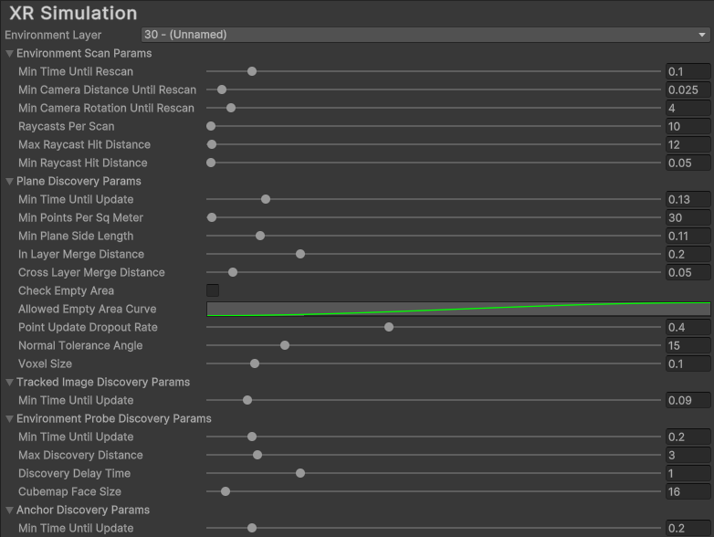
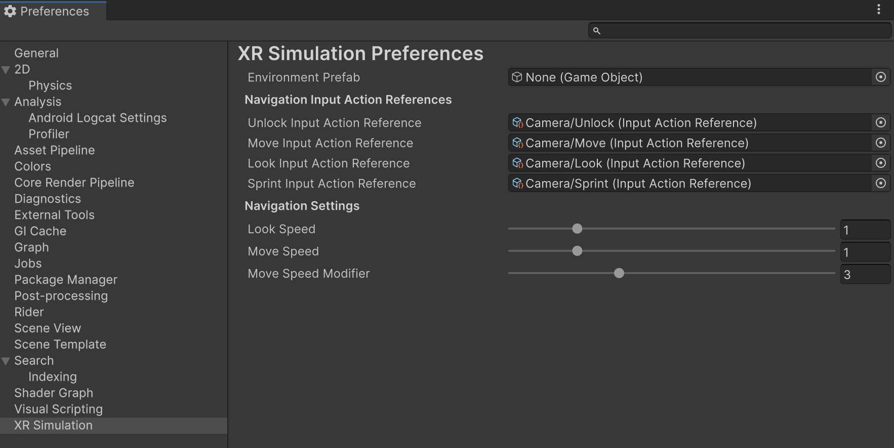

# XR Simulation project settings

Go to **Edit** > **Project Settings** > **XR Plug-in Management** > **XR Simulation** to tune the performance of XR Simulation according to your project's needs. XR Simulation project settings are saved under your Assets folder at `XR/Resources/XRSimulationRuntimeSettings.asset`.

 *XR Simulation project settings*

<table>
  <tr>
   <td colspan="2"><strong>Setting</strong></td>
   <td><strong>Description</strong></td>
  </tr>
  <tr>
   <td colspan="2"><strong>Environment Layer</strong></td>
   <td>XR Simulation requires a dedicated <a href="https://docs.unity3d.com/Manual/Layers.html">layer</a> to render the XR Simulation environment separately from your scene. That layer is specified here, and by default is layer 30.</td>
  </tr>
  <tr>
   <td colspan="2"><strong>Environment Scan Params</strong></td>
   <td>XR Simulation scans for point clouds and planes in the environment by raycasting against its meshes. These settings control that process.</td>
  </tr>
  <tr>
   <td></td>
   <td><strong>Min Time Until Rescan</strong></td>
   <td>Minimum time in seconds that must elapse between environment scans.</td>
  </tr>
  <tr>
   <td></td>
   <td><strong>Min Camera Distance Until Rescan</strong></td>
   <td>Minimum distance in meters the camera must move before the next environment scan. The next environment scan will trigger on the first Update after <strong>Min Time Until Rescan</strong> has elapsed where the camera has either moved at least <strong>Min Camera Distance</strong> or rotated at least <strong>Min Camera Rotation</strong>.</td>
  </tr>
  <tr>
   <td></td>
   <td><strong>Min Camera Rotation Until Rescan</strong></td>
   <td>Minimum angle change in degrees the camera must rotate before the next environment scan. The next environment scan will trigger on the first Update after <strong>Min Time Until Rescan</strong> has elapsed where the camera has either moved at least <strong>Min Camera Distance</strong> or rotated at least <strong>Min Camera Rotation</strong>.</td>
  </tr>
  <tr>
   <td></td>
   <td><strong>Raycasts Per Scan</strong></td>
   <td>Total number of rays to cast in each environment scan. Higher values may impact system performance.</td>
  </tr>
  <tr>
   <td></td>
   <td><strong>Max Raycast Hit Distance</strong></td>
   <td>Distance in meters from the camera beyond which feature points will not be detected.</td>
  </tr>
  <tr>
   <td></td>
   <td><strong>Min Raycast Hit Distance</strong></td>
   <td>Distance in meters from the camera within which feature points will not be detected.</td>
  </tr>
   <td colspan="2"><strong>Plane Discovery Params</strong></td>
   <td>Performance tuning options for plane detection.</td>
  </tr>
  <tr>
   <td></td>
   <td><strong>Min Time Until Update</strong></td>
   <td>Minimum time in seconds that must elapse between plane discovery updates.</td>
  </tr>
  <tr>
   <td></td>
   <td><strong>Min Points Per Sq Meter</strong></td>
   <td>Voxel point density, independent of voxel size.</td>
  </tr>
  <tr>
   <td></td>
   <td><strong>Min Plane Side Length</strong></td>
   <td>A plane with x or y size less than this value in meters will be ignored.</td>
  </tr>
  <tr>
   <td></td>
   <td><strong>In Layer Merge Distance</strong></td>
   <td>Planes within the same layer that are at most this distance in meters from each other will be merged.</td>
  </tr>
  <tr>
   <td></td>
   <td><strong>Cross Layer Merge Distance</strong></td>
   <td>Planes in adjacent layers with an elevation difference of at most this distance in meters will be merged.</td>
  </tr>
  <tr>
   <td></td>
   <td><strong>Check Empty Area</strong></td>
   <td>When enabled, planes will only be created if they do not contain too much empty area.</td>
  </tr>
  <tr>
   <td></td>
   <td><strong>Allowed Empty Area Curve</strong></td>
   <td>Curve that maps the area of a plane to the ratio of area that is allowed to be empty.</td>
  </tr>
  <tr>
   <td></td>
   <td><strong>Point Update Dropout Rate</strong></td>
   <td>Probability of dropping per-plane updates. If a random number between 0 and 1 is below this number, the update is dropped.</td>
  </tr>
  <tr>
   <td></td>
   <td><strong>Normal Tolerance Angle</strong></td>
   <td>If the angle between a point's normal and a voxel grid direction is within this range, the point is added to the grid.</td>
  </tr>
  <tr>
   <td></td>
   <td><strong>Voxel Size</strong></td>
   <td>Side length of each voxel in the plane voxel grid.</td>
  </tr>
  <tr>
   <td colspan="2"><strong>Tracked Image Discovery Params</strong></td>
   <td>Performance tuning options for image tracking.</td>
  </tr>
  <tr>
   <td></td>
   <td><strong>Min Time Until Update</strong></td>
   <td>Minimum time in seconds that must elapse between image tracking updates.</td>
  </tr>
  <tr>
  <tr>
   <td colspan="2"><strong>Environment Probe Discovery Params</strong></td>
   <td>Performance tuning options for discovery of automatically placed environment probes.</td>
  </tr>
  <tr>
   <td></td>
   <td><strong>Min Time Until Update</strong></td>
   <td>Minimum time in seconds between environment probe discovery updates.</td>
  </tr>
  <tr>
   <td></td>
   <td><strong>Max Discovery Distance</strong></td>
   <td>Maximum distance in meters from the camera at which automatically placed environment probes can be discovered.</td>
  </tr>
  <tr>
   <td></td>
   <td><strong>Discovery Delay Time</strong></td>
   <td>Time in seconds after an environment probe is discovered before it is added as a trackable.</td>
  </tr>
  <tr>
   <td></td>
   <td><strong>Cubemap Face Size</strong></td>
   <td>Width and height in pixels of each face of each environment probe's Cubemap.</td>
  </tr>
  <tr>
    <td colspan="2"><strong>Anchor Discovery Params</strong></td>
    <td>Performance tuning options for discovery of automatically placed anchors.</td>
  </tr>
  <tr>
    <td></td>
    <td><strong>Min Time Until Update</strong></td>
    <td>Minimum time in seconds between anchor discovery updates.</td>
  </tr>
</table>

# XR Simulation preferences

Go to menu **Edit** > **Preferences** > **XR Simulation** (Windows) or **Unity** > **Preferences** > **XR Simulation** (Mac) to set your preferences for XR Simulation. Preferences are saved under your Assets folder at `XR/UserSimulationSettings/Resources/XRSimulationPreferences.asset`.

 *XR Simulation preferences*

<table>
  <tr>
   <td colspan="2"><strong>Setting</strong></td>
   <td><strong>Description</strong></td>
  </tr>
  <tr>
   <td colspan="2"><strong>Environment Prefab</strong></td>
   <td>Stores the Prefab asset for the active XR Simulation environment. Note that it is easier to set this in the <a href="simulation-xr-environment-view.md">XR Environment view</a> because the view's Environment list only includes environment Prefabs rather than every Prefab in the project.</td>
  </tr>
  <tr>
   <td colspan="2"><strong>Navigation Input Action References</strong></td>
   <td> Sets input bindings that will be used for navigation controls in XR Simulation (<strong>WASD</strong>, <strong>Q</strong>, <strong>E</strong>, and <strong>Shift</strong> keys and the mouse by default). Refer to <a href="simulation-getting-started.md#navigation-controls">Navigation controls</a> for information about using the default controls or the <a href="https://docs.unity3d.com/Packages/com.unity.inputsystem@latest?subfolder=/manual/index.html">Input System Manual</a> to learn how to create your own custom input actions.</td>
  </tr>
  <tr>
   <td></td>
   <td><strong>Unlock Input Action Reference</strong></td>
   <td><strong>Button</strong> type action that toggles navigation actions on/off. If not set, actions will be active by default.</td>
  </tr>
  <tr>
   <td></td>
   <td><strong>Move Input Action Reference</strong></td>
   <td><strong>Value (Vector 3)</strong> type action that controls movement.</td>
  </tr>
  <tr>
   <td></td>
   <td><strong>Look Input Action Reference</strong></td>
   <td><strong>Value (Delta/Vector 2)</strong> type action that controls rotation.</td>
  </tr>
  <tr>
   <td></td>
   <td><strong>Sprint Input Action Reference</strong></td>
   <td><strong>Button</strong> type action that activates fast movement.</td>
  </tr>
  <tr>
   <td colspan="2"><strong>Navigation Settings</strong></td>
   <td>Other navigation settings for configuring speed during XR Simulation.</td>
  </tr>
  <tr>
   <td></td>
   <td><strong>Look Speed</strong></td>
   <td>Controls the simulation camera's rotation speed.</td>
  </tr>
  <tr>
   <td></td>
   <td><strong>Move Speed</strong></td>
   <td>Controls the simulation camera's base movement speed.</td>
  </tr>
  <tr>
   <td></td>
   <td><strong>Move Speed Modifier</strong></td>
   <td>Modifies the simulation camera's base movement speed for faster movement.</td>
  </tr>
</table>
